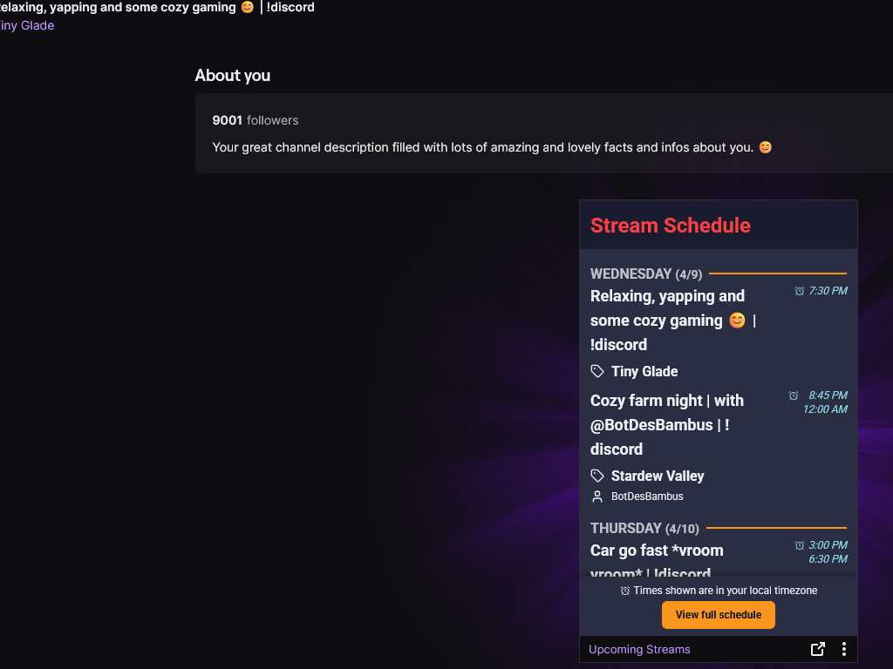

# Upcoming Streams Twitch Extension

A highly customizable Twitch extension that displays a streamer's schedule in their panel with beautiful themes and extensive configuration options. Built with Vue 3, TypeScript, and Tailwind CSS.

📦 [Install on Twitch](https://dashboard.twitch.tv/extensions/fx3l6f5p9rssmjsbn4k0s8zq94rd85)


## Features

- 🎨 **13 Beautiful Pre-built Themes** - Choose from a variety of carefully crafted themes including:
  - Default
  - Neon Nights
  - Mint Chocolate
  - Sunset Vibes
  - Royal Purple
  - Enchanted Forest
  - Retro Wave
  - Crystal Clear
  - Sakura Spring
  - Ocean Breeze
  - Deep Space
  - Golden Hour
  - Lavender Fields

- ⚙️ **Extensive Customization**
  - Custom theme creation with full color control
  - Adjustable font family and size
  - Configurable panel title
  - Toggle visibility of schedule elements:
    - Stream categories
    - Stream titles
    - Usernames
    - Times
    - Header

- 📱 **Responsive Design**
  - Optimized for Twitch's panel dimensions
  - Clean and modern interface
  - Smooth loading states

- 🔄 **Real-time Updates**
  - Automatically syncs with your Twitch schedule
  - Displays vacation mode when enabled
  - Updates immediately when configuration changes

## Screenshots

<div align="center">
  
  <p><em>Panel used on Twitch</em></p>
  
  
  <p><em>Theme Configuration page for broadcasters</em></p>
</div>

## Getting Started

### Prerequisites

- Node.js (v20 or higher recommended)
- npm
- A Twitch Developer Account

### Installation

1. Clone the repository:
```bash
git clone https://github.com/bamboechop/twitch-extension-stream-schedule.git
cd twitch-extension-stream-schedule
```

2. Install dependencies:
```bash
npm install
```

3. Start the development server:
```bash
npm run dev
```

4. Build for production:
```bash
npm run build
```

### Development

The project includes three main entry points:

- `src/App.vue` - Development landing page
- `src/Panel.vue` - The panel view shown on Twitch
- `src/Config.vue` - Configuration page for broadcasters

## Configuration

### Theme Customization

The extension supports both pre-built themes and custom themes. To create a custom theme, use the configuration panel to adjust:

- Background colors
- Text colors
- Border colors
- Button colors

### Panel Settings

Broadcasters can configure:

- Number of schedule items to display
- Font family and size
- Panel title
- Visibility toggles for various elements

## Contributing

We love your input! We want to make contributing to Upcoming Streams Twitch Extension as easy and transparent as possible, whether it's:

- Reporting a bug
- Discussing the current state of the code
- Submitting a fix
- Proposing new features
- Becoming a maintainer

Please note that this project is released with a [Code of Conduct](CODE_OF_CONDUCT.md). By participating in this project you agree to abide by its terms.

Check out our [Contributing Guide](CONTRIBUTING.md) for ways to get started.

## Community & Support

Join our community to get help, share feedback, or connect with other users and developers:

- 💬 [Join our Discord Community](https://discord.com/invite/c2wVV8ccYp)
- 🎮 [Twitch Extension Page](https://dashboard.twitch.tv/extensions/fx3l6f5p9rssmjsbn4k0s8zq94rd85)

For bug reports and feature requests, please use our [GitHub Issues](https://github.com/bamboechop/twitch-extension-stream-schedule/issues) or report them on Discord (`BMBCHP Development > #bug-report` for English, `BMBCHP Entwicklung > #fehler-melden` for German).

## License

This project is licensed under the MIT License - see the [LICENSE](LICENSE) file for details.

## Acknowledgments

- Built with [Vue 3](https://vuejs.org/)
- Styled with [Tailwind CSS](https://tailwindcss.com/)
- Powered by [Twitch API](https://dev.twitch.tv/docs/api/)
